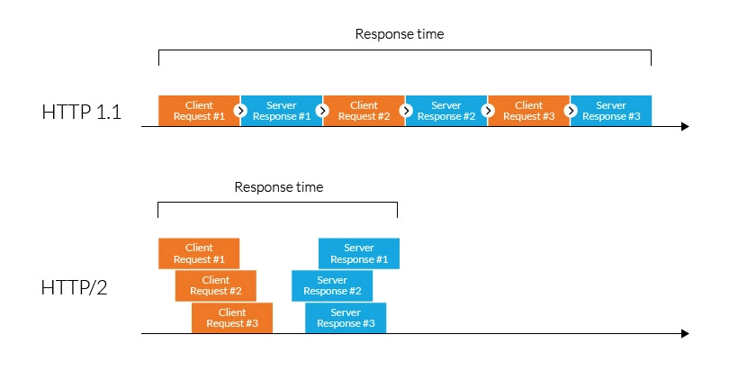

## Introduction

### What is a Protocol?

A network protocol is a set of rules and conventions that define how data is formatted, transmitted, received, and processed within a computer network. It serves as a framework that allows different devices and systems within a network to communicate with each other, regardless of their underlying hardware, software, or architectures.

### What is the HTTP/2 Protocol?

Hypertext Transfer Protocol version 2 (HTTP/2 or HTTP/2.0) is an application protocol and a set of standards responsible for a speedy and seamless data exchange between the client and the website. It was developed in 2015 after an HTTP revision by the Internet Engineering Task Force and derived from the SPDY protocol, providing advanced data communication.

### The Evolution of HTTP

Hypertext Transfer Protocol (HTTP) is a network protocol for communication on the web introduced in 1991. The initial version of HTTP was a simple protocol for retrieving HTML documents. It didn’t include response headers or support for status codes.

With the expanding needs of modern websites and internet users, the [IETF](https://www.ietf.org/about/introduction/) HTTP working group released the next version of HTTP/1.0. It included support for different types of content, such as images and video files, and introduced additional methods like POST and HEAD.

Released in 1997, HTTP/1.1 was the third version of HTTP and the standard protocol for over 15 years. It brought significant enhancements, including the introduction of persistent connections, chunked transfer encoding, and support for virtual hosting. It also introduced new methods like PUT, PATCH, OPTIONS, and DELETE. However, as websites became more resource-intensive, HTTP/1.1’s limitations began to show. Specifically, its use of one outstanding request per TCP connection created significant overhead, slowing down page load times.

In 2010, Google released the [SPDY](https://en.wikipedia.org/wiki/SPDY) protocol as a way of modifying how HTTP handles requests and responses. Its focus was on reducing latency via [TCP pipelining](https://en.wikipedia.org/wiki/HTTP_pipelining) and providing mandatory compression, amongst other features.

While HTTP/2 was initially modeled after SPDY, it was soon modified to include unique features, including a fixed header compression algorithm (in contrast to SPDY’s dynamic stream-based compression). Following its release, Google announced that it would remove support for SPDY in favor of HTTP/2.

### The Need for HTTP/2

With the explosion of rich, dynamic, and media-heavy web applications, HTTP/1.1’s limitations—such as head-of-line blocking, redundant headers, and inefficient connection management—became bottlenecks for performance. HTTP/2 was designed to address these issues and make the web faster, more efficient, and more secure.

---

## Key Features of HTTP/2

### Binary Protocols

HTTP/2 switches from a text-based protocol to a binary protocol. All communication is split into small binary frames, each with a specific type and purpose. This makes parsing more efficient and less error-prone, and enables advanced features like multiplexing and prioritization.

### Multiplexing

  

HTTP/2 allows multiple requests and responses to be in flight simultaneously over a single TCP connection. Frames from different streams can be interleaved, eliminating the head-of-line blocking problem of HTTP/1.1 and reducing latency. This is especially beneficial for web pages that require many resources (CSS, JS, images, etc.).

### Header Compression

HTTP/2 uses the [HPACK](https://httpwg.org/specs/rfc7541.html) compression algorithm to reduce the size of HTTP headers. Since many headers (like cookies, user agents) are repeated across requests, HPACK uses static and dynamic tables, as well as Huffman encoding, to minimize bandwidth usage and speed up communication.

### Server Push

  

Server Push allows the server to proactively send resources to the client before they are requested. For example, when a client requests an HTML page, the server can also push associated CSS and JS files. This reduces round trips and can significantly speed up page loads. However, Server Push must be used judiciously to avoid wasting bandwidth on resources the client may already have cached.

**Benefits of Server Push:**

- Reduces latency by delivering critical resources early.
- Can improve perceived performance for first-time visitors.
- Resources pushed are cached and can be reused across pages.

**Limitations:**

- Not all browsers or CDNs support Server Push.
- Overuse can lead to unnecessary data transfer.

### Stream Prioritization

  

Clients can assign priorities and dependencies to streams, allowing important resources (like CSS or above-the-fold images) to be delivered first. The server can use this information to optimize bandwidth and resource allocation, though actual implementation varies by server.

### Security

  

While HTTP/2 can technically run over plain TCP, all major browsers require HTTP/2 to be used with TLS (HTTPS). The binary framing also helps prevent certain attacks (like response splitting). HTTP/2 does not introduce new security flaws, and in practice, it encourages encrypted, secure communication by default.

---

## HTTP/2 vs HTTP/1.1

| Features              | HTTP/2                                                           | HTTP/1.1                                                           |
| --------------------- | ---------------------------------------------------------------- | ------------------------------------------------------------------ |
| Protocol type         | Binary                                                           | Text-based                                                         |
| Multiplexing          | Multiplexing of requests over a single connection                | One request per connection                                         |
| Compression           | HPACK compression to reduce overhead                             | No compression (headers sent as plain text)                        |
| Server push           | Supported (server can send resources before they are requested)  | Not supported                                                      |
| Stream prioritization | Supported (requests can be prioritized)                          | Not supported                                                      |
| Security              | Run with TLS                                                     | Optional (can be run with or without TLS)                          |
| Resource loading      | More efficient and faster due to multiplexing and prioritization | Inefficient under certain conditions due to connection limitations |

---

## The Main Benefits of HTTP/2

- **Reduced Latency:** Multiplexing and header compression minimize round trips and data transfer.
- **Improved Page Load Speed:** Server Push and prioritization help deliver critical resources faster.
- **Better Resource Utilization:** Fewer TCP connections mean less overhead for both clients and servers.
- **Enhanced Security:** TLS is required by browsers, making encrypted communication the default.
- **Backward Compatibility:** HTTP/2 is designed to be compatible with existing HTTP APIs and semantics.

---

## Client Support

HTTP/2 is widely supported by all major browsers (Chrome, Firefox, Safari, Edge, Opera) and most modern HTTP servers (Nginx, Apache, Caddy, etc.). Mobile browsers and platforms also support HTTP/2, making it a safe choice for most web projects.

---

## Why is HTTP/2 Not Widely Used?

Despite its advantages, HTTP/2 adoption is not universal. Reasons include:

- **Infrastructure Complexity:** Migrating legacy systems and CDNs to support HTTP/2 can be costly and complex.
- **Compatibility:** Some older browsers and proxies do not support HTTP/2, requiring fallback to HTTP/1.1.
- **Marginal Gains for Small Sites:** For simple or low-traffic sites, the performance gains may not justify the migration effort.
- **Server Push Limitations:** Not all CDNs or browsers fully support Server Push, and improper use can waste bandwidth.
- **TLS Requirement:** While beneficial for security, requiring HTTPS can be a barrier for some legacy systems.

---

## Best Practices for HTTP/2

- **Enable HTTPS:** All browsers require HTTP/2 over TLS. Use strong ciphers and keep certificates up to date.
- **Optimize Server Push:** Only push critical resources, and avoid pushing assets the client may already have cached.
- **Monitor Performance:** Use tools like [WebPageTest](https://www.webpagetest.org/) or [Lighthouse](https://developers.google.com/web/tools/lighthouse) to measure the impact of HTTP/2.
- **Review CDN Support:** Ensure your CDN or reverse proxy fully supports HTTP/2 features.
- **Fallback Gracefully:** Configure servers to fall back to HTTP/1.1 for clients that do not support HTTP/2.

---

## Further Reading

- [HTTP/2 Specification (RFC 7540)](https://httpwg.org/specs/rfc7540.html)
- [MDN: HTTP/2](https://developer.mozilla.org/en-US/docs/Web/HTTP/Overview#http2)
- [Google Developers: Introduction to HTTP/2](https://developers.google.com/web/fundamentals/performance/http2)

<Callout>
  HTTP/2 is a major step forward for web performance and security. By
  understanding its features and limitations, you can make informed decisions
  about when and how to adopt it for your projects.
</Callout>
