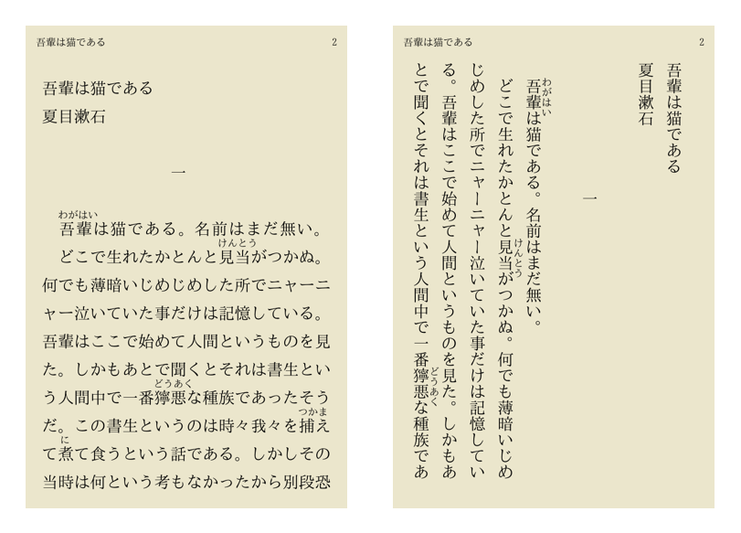

## Introduction

Internationalization, also called “i18n”, is the process of ensuring that your software or application can be easily used and understood by users around the world. Today we won't deal with the translation part but focus on page layout.

Most languages are read from left to right (LTR), however, [languages such as Arabic or Persian use scripts that are read from right to left (RTL)](https://www.w3.org/International/questions/qa-scripts#directions). To handle i18n, we should first set the [dir](https://developer.mozilla.org/en-US/docs/Web/HTML/Global_attributes/dir) attribute and [lang](https://developer.mozilla.org/en-US/docs/Web/HTML/Global_attributes/lang) attribute for html correctly.

**Example:**

```html
<html lang="ar" dir="rtl">
  <!-- Arabic content here -->
</html>
```

Setting these attributes ensures that browsers, screen readers, and search engines interpret your content correctly.

---

## CSS Logical Properties and Values

Physical properties use `left`, `right`, `top`, and `bottom` to determine which side of an element is affected. For example, `margin-left: 1rem` places 1 rem of margin on the left side of an element, regardless of the element’s text direction. [Logical properties and values](https://developer.mozilla.org/en-US/docs/Web/CSS/CSS_logical_properties_and_values) use the abstract terms `block` and `inline` to describe the direction in which they flow. The physical meaning of these terms depends on the [writing mode](https://developer.mozilla.org/en-US/docs/Web/CSS/CSS_writing_modes).

Some physical properties now have logical equivalents. Properties that accept physical values (top, bottom, left, right) now also accept flow-relative logical values (block-start, block-end, inline-start, inline-end).

### Block Dimension

The dimension perpendicular to the flow of text within a line, i.e., the vertical dimension in horizontal writing modes, and the horizontal dimension in vertical writing modes. For standard English text, it is the vertical dimension.

### Inline Dimension

The dimension parallel to the flow of text within a line, i.e., the horizontal dimension in horizontal writing modes, and the vertical dimension in vertical writing modes. For standard English text, it is the horizontal dimension.

### For example:

#### Margin and Padding

- `margin-top` ➡ `margin-block-start`
- `margin-right` ➡ `margin-inline-end`
- `padding-left` ➡ `padding-inline-start`

#### Float

- `float: left` ➡ `float: inline-start`

#### Position

- `left: 0` ➡ `inset-inline-start: 0`[^1]

**Why use logical properties?**  
Logical properties automatically adapt to the writing mode and direction of the document, making your layouts more robust for internationalization. For example, in RTL layouts, `margin-inline-start` will apply to the right side instead of the left.

---

## CSS Writing Mode

Unlike languages that use the Latin script which are primarily laid out horizontally, Asian languages such as Chinese and Japanese [can be laid out vertically](https://www.w3.org/TR/2019/REC-css-writing-modes-3-20191210/#vertical-modes). The [CSS writing modes](https://developer.mozilla.org/en-US/docs/Web/CSS/CSS_writing_modes) module defines various international writing modes, such as left-to-right (e.g., used by Latin and Indic scripts), right-to-left (e.g., used by Hebrew or Arabic scripts), bidirectional (used when mixing left-to-right and right-to-left scripts), and vertical (e.g., used by some Asian scripts).



<Callout>
  For Chinese and Japanese, lines are ordered either right to left or top to
  bottom, while Mongolian and Manchu lines are ordered from left to right.
</Callout>

The [writing-mode](https://developer.mozilla.org/en-US/docs/Web/CSS/writing-mode) CSS property sets whether lines of text are laid out horizontally or vertically, as well as the direction in which blocks progress. When set for an entire document, it should be set on the root element (html element for HTML documents).

### Syntax

```css
/* Keyword values */
writing-mode: horizontal-tb;
writing-mode: vertical-rl;
writing-mode: vertical-lr;
writing-mode: sideways-rl;
writing-mode: sideways-lr;
/* Global values */
writing-mode: inherit;
writing-mode: initial;
writing-mode: revert;
writing-mode: revert-layer;
writing-mode: unset;
```

### Values

- `horizontal-tb` (default): Horizontal, top-to-bottom (e.g., English, French)
- `vertical-rl`: Vertical, right-to-left (e.g., traditional Chinese, Japanese)
- `vertical-lr`: Vertical, left-to-right (e.g., Mongolian)
- `sideways-rl` / `sideways-lr`: Rotates text for vertical layouts

**Example:**

```css
.vertical-text {
  writing-mode: vertical-rl;
  text-orientation: mixed; /* Ensures Latin text is upright */
}
```

---

## Bidirectional (Bidi) Text Support

Some languages, such as Arabic and Hebrew, are written right-to-left (RTL), while others are left-to-right (LTR). In multilingual documents, you may need to mix both directions. Use the `dir` attribute and CSS logical properties to ensure correct rendering.

**Example:**

```html
<p dir="rtl">هذا نص عربي.</p>
<p dir="ltr">This is English text.</p>
```

You can also use the [`bdi`](https://developer.mozilla.org/en-US/docs/Web/HTML/Element/bdi) and [`bdo`](https://developer.mozilla.org/en-US/docs/Web/HTML/Element/bdo) elements to control text direction for inline elements.

---

## Font and Typography Considerations

- Choose fonts that support the character sets of your target languages.
- Use `font-family` stacks that include fallbacks for CJK (Chinese, Japanese, Korean), Arabic, Cyrillic, etc.
- Adjust `line-height`, `letter-spacing`, and `font-size` for readability in different scripts.
- Use `text-orientation` for vertical scripts to control how characters are displayed.

**Example:**

```css
body {
  font-family:
    system-ui, 'Segoe UI', 'PingFang SC', 'Hiragino Sans', 'Noto Sans JP',
    'Arial', sans-serif;
}
```

---

## Responsive Layouts and Internationalization

- Text expansion: Some languages (e.g., German, Russian) require more space than English. Design flexible layouts that can accommodate longer words or phrases.
- Avoid fixed-width containers for text-heavy content.
- Use CSS Grid and Flexbox with logical properties for adaptable layouts.

---

## Summary

By accounting for internationalization, you can ensure your product is inclusive to users around the world. Early in the development process of a new product, this may not seem necessary, particularly if your target market is not international. However, by keeping it in mind early and baking it into your CSS, you can avoid needing to refactor a large portion of your code base.

**Key takeaways:**

- Always set `lang` and `dir` attributes appropriately.
- Prefer logical CSS properties over physical ones.
- Use `writing-mode` and `text-orientation` for vertical and complex scripts.
- Test your layouts with real multilingual content.

**Further reading:**

- [MDN: CSS Logical Properties](https://developer.mozilla.org/en-US/docs/Web/CSS/CSS_logical_properties_and_values)
- [MDN: CSS Writing Modes](https://developer.mozilla.org/en-US/docs/Web/CSS/CSS_writing_modes)
- [W3C: Internationalization Techniques](https://www.w3.org/International/techniques/authoring-html)
- [Unicode Common Locale Data Repository](https://cldr.unicode.org/)

[^1]: [inset](https://developer.mozilla.org/en-US/docs/Web/CSS/inset)
