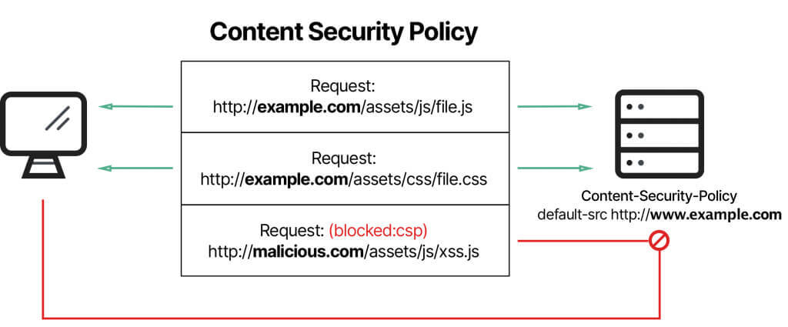

## Introduction

Content Security Policy ([CSP](https://developer.mozilla.org/en-US/docs/Web/HTTP/CSP)) is a browser security mechanism that aims to mitigate Cross-Site Scripting ([XSS](https://developer.mozilla.org/en-US/docs/Glossary/Cross-site_scripting)), clickjacking, data injection, and other client-side attacks. It works by restricting the resources (such as scripts, images, styles, fonts, and frames) that a page can load and restricting whether a page can be framed by other pages.



To enable CSP, a response needs to include an HTTP response header called `Content-Security-Policy` with a value containing the policy. The policy itself consists of one or more directives, separated by semicolons.

---

## Threats

### Mitigating Cross-Site Scripting (XSS)

By preventing the page from executing inline scripts, attacks like injecting

```html
<script>
  document.body.innerHTML = 'defaced'
</script>
```

will not work if CSP disallows inline scripts.

By preventing the page from loading scripts from arbitrary servers, attacks like injecting

```html
<script src="https://evil.com/hacked.js"></script>
```

will also be blocked if the CSP restricts script sources.

### Mitigating Clickjacking and Framing Attacks

CSP can prevent your site from being embedded in iframes on other domains using the `frame-ancestors` directive, mitigating clickjacking attacks.

### Mitigating Packet Sniffing and Mixed Content

CSP can enforce that all resources are loaded over HTTPS, preventing mixed content and reducing the risk of man-in-the-middle attacks. Combine CSP with `Strict-Transport-Security` and the `Secure` cookie attribute for best results.

---

## How CSP Works

CSP is enforced by the browser. When a page is loaded, the browser reads the CSP header or `<meta>` tag and applies the specified restrictions. If a resource violates the policy, it is blocked and a violation is reported to the browser console (and optionally to a reporting endpoint).

**Example CSP header:**

```http
Content-Security-Policy: default-src 'self'; img-src 'self' https://images.example.com; script-src 'self' https://cdn.example.com
```

This policy allows all resources by default only from the same origin, images from the same origin and `images.example.com`, and scripts from the same origin and `cdn.example.com`.

---

## CSP Directive Reference

This documentation is provided based on the [Content Security Policy Level 2](https://www.w3.org/TR/CSP2/) W3C Recommendation, and the [Content Security Policy Level 3](https://www.w3.org/TR/CSP3/) W3C Working Draft.

### Fetch Directives

Fetch directives tell the browser the locations to trust and load resources from. Most fetch directives have a [fallback list](https://www.w3.org/TR/CSP3/#directive-fallback-list). This allows for granular control of the source of scripts, images, files, etc.

- `default-src`: Fallback for other fetch directives.
- `script-src`: Controls allowed script sources.
  - `script-src-elem`: Controls script elements.
  - `script-src-attr`: Controls inline event handlers.
- `style-src`: Controls allowed style sources.
  - `style-src-elem`, `style-src-attr`: More granular style controls.
- `img-src`: Controls allowed image sources.
- `connect-src`: Controls allowed endpoints for XHR, fetch, WebSocket, etc.
- `font-src`: Controls allowed font sources.
- `object-src`: Controls allowed plugin sources.
- `media-src`: Controls allowed audio/video sources.
- `child-src`: Controls allowed nested browsing contexts and workers.
- `manifest-src`: Controls allowed manifest sources.
- `prefetch-src`: Controls allowed prefetch sources.

### Document Directives

- `sandbox`: Restricts page actions (e.g., form submission, script execution).
- `base-uri`: Restricts the URLs allowed in the `<base>` element.
- `plugin-types`: Limits allowed plugin MIME types.

### Navigation Directives

- `form-action`: Restricts allowed form submission URLs.
- `frame-ancestors`: Restricts which sites can embed the page in a frame or iframe.
- `navigate-to`: Restricts allowed navigation destinations.

### Reporting Directives

- `report-uri` (deprecated): Where to send violation reports.
- `report-to`: Modern replacement for `report-uri`, uses the Reporting API.

---

## Source List Reference

| Source Value         | Example                       | Description                                                                     |
| -------------------- | ----------------------------- | ------------------------------------------------------------------------------- |
| `*`                  | `img-src *`                   | Wildcard, allows any URL except data:, blob:, filesystem: schemes.              |
| `'none'`             | `object-src 'none'`           | Prevents loading resources from any source.                                     |
| `'self'`             | `script-src 'self'`           | Allows loading resources from the same origin (scheme, host, port).             |
| `data:`              | `img-src 'self' data:`        | Allows loading resources via the data scheme (e.g., Base64 encoded images).     |
| `https:`             | `img-src https:`              | Allows loading resources only over HTTPS on any domain.                         |
| `domain.example.com` | `img-src domain.example.com`  | Allows loading resources from the specified domain name.                        |
| `*.example.com`      | `img-src *.example.com`       | Allows loading resources from any subdomain under example.com.                  |
| `'unsafe-inline'`    | `script-src 'unsafe-inline'`  | Allows inline scripts or styles (not recommended for security).                 |
| `'unsafe-eval'`      | `script-src 'unsafe-eval'`    | Allows use of JavaScript `eval()` and similar methods (not recommended).        |
| `'nonce-...'`        | `script-src 'nonce-abc123'`   | Allows inline scripts/styles with a matching nonce attribute.                   |
| `'sha256-...'`       | `script-src 'sha256-xyz...'`  | Allows inline scripts/styles with a matching hash.                              |
| `'strict-dynamic'`   | `script-src 'strict-dynamic'` | Allows scripts loaded by trusted scripts to execute, even if not in the policy. |

---

## Implementing Content Security Policy

You can deploy a CSP as an HTTP response header or an HTML meta tag.

**HTTP header example:**

```http
Content-Security-Policy: default-src 'self'; img-src 'self' https://images.example.com; script-src 'self' https://cdn.example.com
```

**HTML meta tag example:**

```html
<meta
  http-equiv="Content-Security-Policy"
  content="default-src 'self'; img-src 'self'; script-src 'self'"
/>
```

**Best practice:** Always prefer the HTTP header, as some directives (like `frame-ancestors`) are ignored in meta tags.

---

## Reporting and Monitoring

CSP can be deployed in "report-only" mode to monitor violations without enforcing the policy:

```http
Content-Security-Policy-Report-Only: default-src 'self'; report-uri /csp-report-endpoint
```

This allows you to test your policy and collect violation reports before enforcing it.

---

## Practical Tips and Pitfalls

- **Start with a loose policy in report-only mode, then tighten it based on violation reports.**
- Avoid `'unsafe-inline'` and `'unsafe-eval'` whenever possible.
- Use nonces or hashes for inline scripts/styles if you must allow them.
- Specify all resource types you use (`img-src`, `font-src`, etc.) for fine-grained control.
- Remember that third-party scripts and widgets may require additional sources.
- Regularly review and update your CSP as your site evolves.

---

## Example: A Strict CSP Policy

```http
Content-Security-Policy:
  default-src 'self';
  script-src 'self' https://trusted.cdn.com 'nonce-abc123';
  style-src 'self' 'nonce-xyz456';
  img-src 'self' https://images.example.com;
  font-src 'self';
  object-src 'none';
  frame-ancestors 'none';
  base-uri 'self';
  report-uri /csp-report-endpoint
```

---

## Summary

A well-configured Content Security Policy is a powerful defense-in-depth tool for modern web applications. It helps prevent XSS, clickjacking, and data injection attacks by restricting what resources can be loaded and executed. CSP should be used in combination with other security measures (such as input validation, secure cookies, and HTTPS) for maximum protection.

**Further reading:**

- [MDN: Content Security Policy (CSP)](https://developer.mozilla.org/en-US/docs/Web/HTTP/CSP)
- [Google Web Fundamentals: CSP](https://web.dev/csp/)
- [CSP Evaluator](https://csp-evaluator.withgoogle.com/)
- [OWASP: Content Security Policy Cheat Sheet](https://cheatsheetseries.owasp.org/cheatsheets/Content_Security_Policy_Cheat_Sheet.html)
