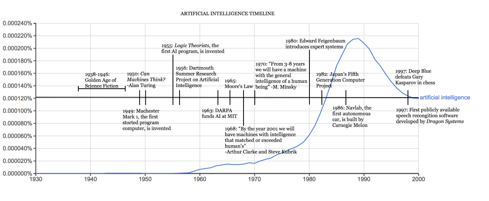

# What is AI?

AI is an area of computer science that aims to make machines do intelligent things, that is, learn and solve problems, similar to the natural intelligence of humans and animals. In AI, an intelligent agent receives information from the environment, performs computations to decide what action to take in order to achieve the goal, and takes actions autonomously. AI can improve its performance with learning.

# The history of AI

AI can be traced back to the 1940s, during World War II, when Alan Turing, a British mathematician and computer scientist, developed a code-breaking machine called [bombe](https://en.wikipedia.org/wiki/Bombe) in Bletchley Park, United Kingdom, that deciphered German [Enigma](https://en.wikipedia.org/wiki/Enigma_machine)-encrypted messages.

In October 1950, while working at the University of Manchester, Turing published a paper entitled [_Computing Machinery and Intelligence_](https://academic.oup.com/mind/article/LIX/236/433/986238) in the journal Mind (Oxford University Press). In this paper, he proposed an experiment called the imitation game, and that became known as the famous [Turing test](https://en.wikipedia.org/wiki/Turing_test). The Truing test has since been used to test a machine's intelligence to see if it is equivalent to a human.

AI as a research discipline was established at a workshop at Dartmouth College in 1956, organized by John McCarthy, a young assistant professor of mathematics at the college. The workshop lasted about six to eight weeks, and it was essentially an extended brainstorming session. (https://raysolomonoff.com/dartmouth/)

From the 1950s to the 1970s, artificial neural networks attracted a lot of attention. But since the late 1960s, after many disappointments and criticisms, funding and research activities were significantly reduced; this was the first AI winter. A famous case was the failure of machine translation in 1966. After spending $20 million to fund a research project, the National Research Council (NRC) concluded that machine translation was more expensive, less accurate and slower than human translation.

In 1973, the British Parliament commissioned Professor Sir James Lighthill to assess the state of AI research in the United Kingdom. His report, the famous [Lighthill Report](https://www.aiai.ed.ac.uk/events/lighthill1973/lighthill.pdf), criticized the utter failure of AI and concluded that nothing done in AI couldn't be done in other sciences. The report also pointed out that many of AI's most successful algorithms would not work on real-world problems.

In the 1980s, a form of AI program called the [expert system](https://en.wikipedia.org/wiki/Expert_system) became popular around the world. The first commercial expert system was developed at Carnegie Mellon for Digital Equipment Corporation. It was an enormous success and saved the company millions of dollars. Companies around the world began to develop and deploy their own expert systems. However, by the early 1990s, most commercial expert system companies had failed.

Now, [deep learning](https://en.wikipedia.org/wiki/Deep_learning) is developing at a fast speed, attracting lots of activities and funding, with exciting developments every day.

### Key Moments of AI

1. Alan Turing proposed the Truing test (1950)
1. Dartmouth held an AI workshop (1956)
1. Frank Rosenblatt built the Perceptron (1957)
1. The first AI winter (1970s)
1. The second AI winter (1987)
1. IBM's Deep Blue beats Kasparov (1997)
1. Geoffrey Hinton unleashed deep learning networks (2012)
1. AlphaGo defeated legendary Go player Lee Sedol (2016)
1. OpenAI released GPT-3 (2020)
1. AlphaFold predicted a protein's 3D structure from its amino acid sequence (2020)
1. OpenAI released Sora (2024)
