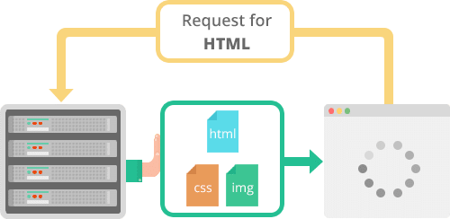

# Introduction

### What is a Protocol?

A network protocol is a set of rules and conventions that define how data is formatted, transmitted, received, and processed within a computer network. It serves as a framework that allows different devices and systems within a network to communicate with each other, regardless of their underlying hardware, software, or architectures.

### What is the HTTP/2 Protocol?

Hypertext Transfer Protocol version 2 (HTTP/2 or HTTP/2.0) is an application protocol and a set of standards responsible for a speedy and seamless data exchange between the client and the website. It was developed in 2015 after an HTTP revision by the Internet Engineering Task Force and derived from the SPDY protocol, providing advanced data communication.

### The Evolution of HTTP

Hypertext Transfer Protocol (HTTP) is a network protocol for communication on the web introduced in 1991. The initial version of HTTP was a simple protocol for retrieving HTML documents. It didn’t include response headers or support for status codes.

With the expanding needs of modern websites and internet users, the [IETF](https://www.ietf.org/about/introduction/) HTTP working group released the next version of HTTP/1.0. It included support for different types of content, such as images and video files, and introduced additional methods like POST and HEAD.

Released in 1997, HTTP/1.1 was the third version of HTTP and the standard protocol for over 15 years. It brought significant enhancements, including the introduction of persistent connections, chunked transfer encoding, and support for virtual hosting. It also introduced new methods like PUT, PATCH, OPTIONS, and DELETE. However, as websites became more resource-intensive, HTTP/1.1’s limitations began to show. Specifically, its use of one outstanding request per TCP connection created significant overhead, slowing down page load times.

In 2010, Google released the [SPDY](https://en.wikipedia.org/wiki/SPDY) protocol as a way of modifying how HTTP handles requests and responses. Its focus was on reducing latency via [TCP pipelining](https://en.wikipedia.org/wiki/HTTP_pipelining) and providing mandatory compression, amongst other features.

While HTTP/2 was initially modeled after SPDY, it was soon modified to include unique features, including a fixed header compression algorithm (in contrast to SPDY’s dynamic stream-based compression). Following its release, Google announced that it would remove support for SPDY in favor of HTTP/2.

### The Need for HTTP/2

# Key Features of HTTP/2

## Binary Protocols

In HTTP/2, the data is divided into smaller units called frames, which are binary packets that carry specific types of information. Each frame has a specific format, including a frame header that indicates its type and length. These frames are then sent over a single client-server connection, allowing for concurrent and interleaved communication. The binary format reduces the amount of data that needs to be transmitted, improving performance.

## Multiplexing

  

HTTP/2 uses multiplexing to allow multiple concurrent requests and responses over a single TCP connection. With multiplexing, requests, and responses are divided into smaller units called frames. These frames are then interleaved and sent in a non-blocking manner. This means that if one request is delayed due to network congestion, other requests can continue to be processed, it eliminates the issue of head-of-line blocking, where one slow request can delay the delivery of subsequent HTTP requests. As a result, this feature helps reduce latency and promotes increased customer satisfaction.

## Header Compression

HTTP/2 utilizes a header compression mechanism to reduce the overhead associated with HTTP headers. This compression technique reduces the size of the headers, resulting in lower bandwidth consumption and faster communication between the client and server. The mechanism uses the [HPACK](https://httpwg.org/specs/rfc7541.html) (HTTP/2 Static Table and Huffman Encoding) algorithm to compress headers. HPACK utilizes techniques such as Huffman encoding, indexing, and dynamic table management to minimize the size of headers without losing any critical information.

## Server Push

  

One of the notable features of HTTP/2 is server push. With it, the server can proactively send resources to satisfy the client’s future requests. This feature reduces the number of round trips required between both – the client and server, resulting in faster page load speed. As the infographic above shows, upon a single client request, the server pushes 3 assets – the HTML along with CSS and images. Thanks to that preemptive push of website assets, HTTP/2 facilitates and speeds up page rendering.

HTTP/2 implementation presents significant performance for pushed resources, with other benefits of HTTP/2 explained below:

- The client saves pushed resources in the cache.
- The client can reuse these cached resources across different pages.
- The server can multiplex pushed resources along with originally requested information within the same TCP connection.
- The server can prioritize pushed resources – a key performance differentiator in HTTP/2 vs HTTP1.
- The client can decline pushed resources to maintain an effective repository of cached resources or disable Server Push entirely.
- The client can also limit the number of pushed streams multiplexed concurrently.

## Stream Prioritization

  

Stream prioritization allows the client to provide preference to particular data streams. Although the server is not bound to follow these instructions from the client, the mechanism allows the server to optimize network resource allocation based on end-user requirements. Stream prioritization works with Dependencies and Weight assigned to each stream. Although all streams are inherently dependent on each other, the dependent streams are also assigned weights between 1 and 256. The details of stream prioritization mechanisms are still debated.

In the real world, however, the server rarely has control over resources such as CPU and database connections. Implementation complexity itself prevents servers from accommodating stream priority requests. Research and development in this area are particularly important for the long-term success of HTTP/2 since the protocol is capable of processing multiple data streams with a single TCP connection.

## Security

  

Binary HTTP/2 format prevents response splitting attacks common with HTTP/1.1. Hackers carry out response splitting by altering the textual response and inserting whitespaces. This is not a threat to an HTTP/2 binary protocol. Moreover, HTTP/2 comes with TLS encryption, ensuring security and privacy.

# HTTP/2 vs HTTP/1.1

| Features              | HTTP/2                                                           | HTTP/1.1                                                           |
| --------------------- | ---------------------------------------------------------------- | ------------------------------------------------------------------ |
| Protocol type         | Binary                                                           | Text-based                                                         |
| Multiplexing          | Multiplexing of requests over a single connection                | One request per connection                                         |
| Compression           | HPACK compression to reduce overhead                             | No compression (headers sent as plain text)                        |
| Server push           | Supported (server can send resources before they are requested)  | Not supported                                                      |
| Stream prioritization | Supported (requests can be prioritized)                          | Not supported                                                      |
| Security              | Run with TLS                                                     | Optional (can be run with or without TLS)                          |
| Resource loading      | More efficient and faster due to multiplexing and prioritization | Inefficient under certain conditions due to connection limitations |

# The Main Benefits of HTTP/2

The main benefits of using HTTP/2 are efficiency solutions to improve web performance, optimize resource use, and reduce browsing latency. One of the most beneficial HTTP/2 features is multiplexing, which handles multiple streams simultaneously over a single connection, reducing network latency. It also improves performance by compressing HTTP headers sent over the network and prioritizing network resource allocation. Moreover, the HTTP/2 binary protocol format and default TLS encryption can help enhance browsing security.

# Client Support

Google Chrome and Firefox have supported the technology for years and Apple added HTTP/2 browser support to the Safari web browser back in 2014. Internet Explorer requires users to run Windows 8 to support the latest application protocol. Major mobile web browsers including Android’s aptly named Browser, Chrome for Android and iOS, as well as Safari in iOS 8 and above support HTTP/2 for mobile web access.

# Why is HTTP/2 Not Widely Used?

The adoption of HTTP/2 is not as widespread as network engineers might have expected. This could be due to several reasons. First, employing HTTP/2 might be costly and complex for organizations with widespread infrastructure. Correctly establishing HTTP/2 may require extra technical knowledge. Moreover, some older browsers may not be compatible with the HTTP/2 protocol. So organizations that serve a diverse user base may hesitate to adopt it. Furthermore, the performance gain from HTTP/2 may not be sufficient enough to invest funds and human and server resources into adopting the protocol for smaller websites. Another reason system admins opt out of HTTP/2 is that the content delivery network that enhances web performance cannot fully support HTTP/2, reducing the expected needs.
