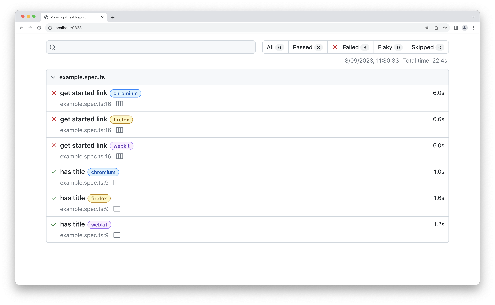
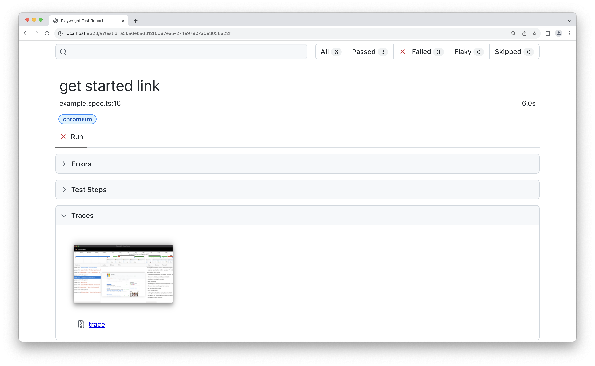
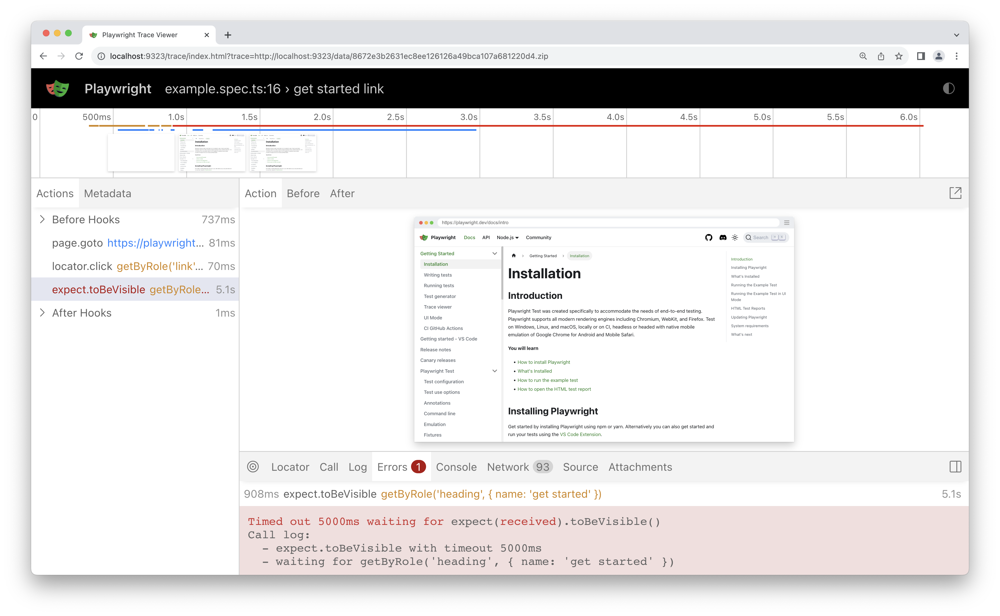

# Introduction

[Playwright](https://playwright.dev/) enables reliable end-to-end testing for modern web apps. Playwright Test was created specifically to accommodate the needs of end-to-end testing. Playwright supports all modern rendering engines including Chromium, WebKit, and Firefox. Test on Windows, Linux, and macOS, locally or on CI, headless or headed with native mobile emulation of Google Chrome for Android and Mobile Safari.

_[Best Practices](https://playwright.dev/docs/best-practices)_

# Out-of-the-box test assertions

`Playwright` includes test assertions in the form of `expect` function. To make an assertion, call `expect(value)` and choose a matcher that reflects the expectation. There are many [generic matchers](https://playwright.dev/docs/api/class-genericassertions) like `toEqual`, `toContain`, and `toBeTruthy` that can be used to assert any conditions.

### Soft assertions

By default, the failed assertion will terminate the test execution. Playwright also supports soft assertions: failed soft assertions do not terminate test execution, but mark the test as failed.

```js /expect.soft/
// Make a few checks that will not stop the test when failed...
await expect.soft(page.getByTestId('status')).toHaveText('Success')
await expect.soft(page.getByTestId('eta')).toHaveText('1 day')
// ... and continue the test to check more things.
await page.getByRole('link', { name: 'next page' }).click()
await expect
  .soft(page.getByRole('heading', { name: 'Make another order' }))
  .toBeVisible()
```

At any point during test execution, you can check whether there were any soft assertion failures:

```js
// Make a few checks that will not stop the test when failed...
await expect.soft(page.getByTestId('status')).toHaveText('Success')
await expect.soft(page.getByTestId('eta')).toHaveText('1 day')
// Avoid running further if there were soft assertion failures.
expect(test.info().errors).toHaveLength(0)
```

**Note that soft assertions only work with Playwright test runner.**

# Support multiple browsers

Playwright can run tests on Chromium, WebKit and Firefox browsers as well as branded browsers such as Google Chrome and Microsoft Edge. It can also run on emulated tablets and mobile devices.

Playwright can run your tests in multiple browsers and configurations by setting up projects in the config. You can also add [different options](https://playwright.dev/docs/test-configuration) for each project.

```js
import { defineConfig, devices } from '@playwright/test'

export default defineConfig({
  projects: [
    /* Test against desktop browsers */
    {
      name: 'chromium',
      use: { ...devices['Desktop Chrome'] },
    },
    {
      name: 'firefox',
      use: { ...devices['Desktop Firefox'] },
    },
    {
      name: 'webkit',
      use: { ...devices['Desktop Safari'] },
    },
    /* Test against mobile viewports. */
    {
      name: 'Mobile Chrome',
      use: { ...devices['Pixel 5'] },
    },
    {
      name: 'Mobile Safari',
      use: { ...devices['iPhone 12'] },
    },
    /* Test against branded browsers. */
    {
      name: 'Google Chrome',
      use: { ...devices['Desktop Chrome'], channel: 'chrome' }, // or 'chrome-beta'
    },
    {
      name: 'Microsoft Edge',
      use: { ...devices['Desktop Edge'], channel: 'msedge' }, // or 'msedge-dev'
    },
  ],
})
```

<Callout type="warning">
  Certain Enterprise Browser Policies may impact Playwright's ability to launch
  and control Google Chrome and Microsoft Edge. Running in an environment with
  browser policies is outside of the Playwright project's scope.
</Callout>
User-friendly to develop and debug

## Generating tests

Use the `codegen` command to run the test generator followed by the URL of the website you want to generate tests for. The URL is optional and you can always run the command without it and then add the URL directly into the browser window instead.

```sh
npx playwright codegen demo.playwright.dev/todomvc
```

Run `codegen` and perform actions in the browser. Playwright will generate the code for the user interactions. Codegen will look at the rendered page and figure out the recommended locator, prioritizing role, text and test id locators. If the generator identifies multiple elements matching the locator, it will improve the locator to make it resilient and uniquely identify the target element, therefore eliminating and reducing test(s) failing and flaking due to locators.

You can also generate tests using emulation to generate a test for a specific viewport, device, or color scheme, as well as emulate the geolocation, language or timezone. The test generator can also generate a test while preserving the authenticated state. Check out the [Test Generator](https://playwright.dev/docs/codegen#emulation) guide to learn more.

With the test generator, you can record:

- `assert visibility` to assert that an element is visible
- `assert text` to assert that an element contains specific text
- `assert value` to assert that an element has a specific value

## Debug tests in UI mode

It's highly recommended to debug your tests with UI Mode for a better developer experience where you can easily walk through each step of the test and visually see what was happening before, during and after each step. UI mode also comes with many other features such as the locator picker, watch mode and more.

```sh
npx playwright test --ui
```

While debugging you can use the Pick Locator button to select an element on the page and see the locator that Playwright would use to find that element. You can also edit the locator in the locator playground and see it highlighting live on the Browser window. Use the Copy Locator button to copy the locator to your clipboard and then paste it into your test.

To debug one test file, run the Playwright test command with the name of the test file that you want to debug followed by the `--debug` flag.

```sh
npx playwright test example.spec.ts --debug
```

To debug a specific test from the line number where the `test(..` is defined, add a colon followed by the line number at the end of the test file name, followed by the `--debug` flag.

```sh
npx playwright test example.spec.ts:10 --debug
```

## Test reports

The [HTML Reporter](https://playwright.dev/docs/test-reporters#html-reporter) shows you a full report of your tests allowing you to filter the report by browsers, passed tests, failed tests, skipped tests and flaky tests. By default, the HTML report is opened automatically if some of the tests fail, otherwise, you can open it with the following command.

```sh
npx playwright show-report
```

# Trace viewer

Playwright Trace Viewer is a GUI tool that lets you explore recorded Playwright traces of your tests meaning you can go back and forward through each action of your test and visually see what was happening during each action.

In the HTML report click on the trace icon next to the test name file name to directly open the trace for the required test.

You can also click open the detailed view of the test scroll down to the `Traces` tab and open the trace by clicking on the trace screenshot.


View traces of your test by clicking through each action or hovering using the timeline and see the state of the page before and after the action. Inspect the log, source and network, errors and console during each step of the test. The trace viewer creates a DOM snapshot so you can fully interact with it and open the browser DevTools to inspect the HTML, CSS, etc.

To learn more about traces check out the detailed guide on [Trace Viewer](https://playwright.dev/docs/trace-viewer).

# Support multiple languages

Playwright is available in multiple languages that share the same underlying implementation. All core features for automating the browser are supported in all languages while testing ecosystem integration is different. You can pick the language based on your experience, familiarity with its testing ecosystem and your project constraints. For more information, check out [supported languages](https://playwright.dev/docs/languages).

# Mock APIs

Web APIs are usually implemented as HTTP endpoints. Playwright provides APIs to mock and modify network traffic, both HTTP and HTTPS. Any requests that a page does, including XHRs and fetch requests, can be tracked, modified and mocked. With Playwright you can also mock using HAR files that contain multiple network requests made by the page.

The following code will intercept all the calls to `*/**/api/v1/fruits` and will return a custom response instead. No requests to the API will be made. The test goes to the URL that uses the mocked route and asserts that mock data is present on the page.

```js {3-6}
test("mocks a fruit and doesn't call api", async ({ page }) => {
  // Mock the api call before navigating
  await page.route('*/**/api/v1/fruits', async (route) => {
    const json = [{ name: 'Strawberry', id: 21 }]
    await route.fulfill({ json })
  })
  // Go to the page
  await page.goto('https://demo.playwright.dev/api-mocking')
  // Assert that the Strawberry fruit is visible
  await expect(page.getByText('Strawberry')).toBeVisible()
})
```

As more and more front-end projects are turning into microservices, our project can be a small part of a large website, which makes it harder to run our project alone. When we are doing e2e testing online, with the proxy ability playwright offers us, we can easily proxy partial JS and CSS files request to our local dev server, and make it a lot easier to develop test cases when we need to change source code or add test id.

```js
export default defineConfig({
  ...
  // Run your local dev server before starting the tests.
  webServer: {
    command: 'npm run start',
    url: 'http://127.0.0.1:3000',
    reuseExistingServer: !process.env.CI,
  },
})
```

For more information, check out [webServer](https://playwright.dev/docs/api/class-testconfig#test-config-web-server).

# Out-of-the-box snapshot

Playwright provides methods for comparing page and element screenshots with expected values stored in files.

```js
expect(screenshot).toMatchSnapshot('landing-page.png')
```

<Callout type="warning">
  To compare screenshots, use expect(page).toHaveScreenshot() instead.
</Callout>

```js
// Basic usage.
expect(await page.screenshot()).toMatchSnapshot('landing-page.png')
// Pass options to customize the snapshot comparison and have a generated name.
expect(await page.screenshot()).toMatchSnapshot('landing-page.png', {
  maxDiffPixels: 27, // allow no more than 27 different pixels.
})
// Configure image matching threshold.
expect(await page.screenshot()).toMatchSnapshot('landing-page.png', {
  threshold: 0.3,
})
// Bring some structure to your snapshot files by passing file path segments.
expect(await page.screenshot()).toMatchSnapshot(['landing', 'step2.png'])
expect(await page.screenshot()).toMatchSnapshot(['landing', 'step3.png'])
```

Learn more about [visual comparisons](https://playwright.dev/docs/test-snapshots).

**Note that matching snapshots only work with Playwright test runner.**

<Callout>
  Since there can be significant differences among snapshots on different OS or
  headed/headless mode, it's better to run snapshot test cases on Linux headless
  mode using docker image to keep the same environment with CI.
</Callout>

Script to run docker image:

```sh
docker run -it --rm --ipc=host -v $(pwd):/work/ -w /work/ mcr.microsoft.com/playwright:v1.42.1-jammy /bin/bash
```
