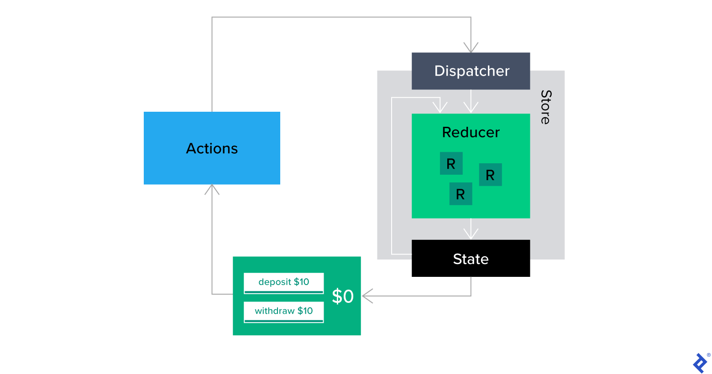
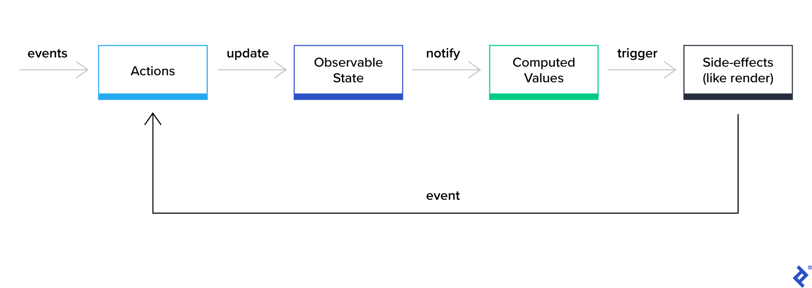

# Introduction

### What is State?

State can be defined as an object that houses data that changes over time in an application. In other words, state is a dynamic data storage that provides a mechanism for components to manage, keep track of changing data, and trigger re-rendering when it is updated.

### When to Use State

When building an application, data plays an integral role in what is been displayed or stored. The same applies to building web applications in React, where components display or operate on data — which can be user input, data fetched from APIs, or any other dynamic content. When there is a need to get data that has to be updated inside of a component, we use state.

### Why is State Management Important?

State represents the data that changes over time in your application, and properly managing it ensures your app functions correctly. It helps you avoid common pitfalls like data inconsistency, prop drilling, and unnecessary re-renders.

# Different Approaches to Managing State in React

## Component State

Each React component has its internal state, which can be used to store and manage data that is specific to that component. This state is managed using the setState method, which updates the component’s state and triggers a re-render.

```jsx {3} {5} {8}
import { useState } from 'react'
function Counter() {
  const [count, setCount] = useState(0)
  const increment = () => {
    setCount(count + 1)
  }
  const decrement = () => {
    setCount(count - 1)
  }
  return (
    <div>
      <h1>{count}</h1>
      <button onClick={increment}>+</button>
      <button onClick={decrement}>-</button>
    </div>
  )
}
```

Using local state, components can independently change and handle their data which leads to partitioning within the application. However, problems may arise when the state should be shared among many components. Engineers have to find tools and libraries that suit their needs, yet at the same time meet the high standards needed for enterprise-grade apps.

## Global State

These are states that are accessible to every component in the application. It is always declared and located in the root component of your app before the JSX is returned. A state can be considered as a global state if it is a piece of data that is accessible among multiple components thereby, aiding communication between components in the application.

### Consider Using React Context API

[React’s Context API](https://react.dev/learn/passing-data-deeply-with-context) is a built-in solution for sharing state across components without resorting to a global state management library. It allows you to pass data through the component tree without passing props explicitly at every level. Context is ideal for smaller applications or when you need to share state between a few closely related components. However, be cautious with using Context, as it can lead to performance issues if overused. The only advantage of Context is that it doesn’t depend on a third-party library, but that can’t outweigh the effort to maintain this approach.

As React team member [Sebastian Markbage mentioned](https://github.com/facebook/react/issues/14110#issuecomment-448074060), the Context API was not built and optimized for high-frequency updates but rather for low-frequency updates like theme updates and authentication management.

## React State Management Libraries

React state management libraries can be divided into three groups:

- `Reducer-based`: requires dispatching actions to update a big centralized state, often called a “single source of truth”. In this group, we have [Redux](#redux) and [Zustand](#zustand).
- `Atom-based`: splits states into tiny pieces of data called atoms, which can be written to and read from using React hooks. In this group, we have [Recoil](#recoil) and [Jotai](#jotai).
- `Mutable-based`: leverages proxy to create mutable data sources which can be directly written to or reactively read from. Candidates in this group are [MobX](#mobx) and [Valtio](#valtio).

#### Reducer-based Libraries



### Redux

[Redux](https://redux.js.org/) is a state container created in 2015, no React state management library list would be complete without Redux. In Redux, you can change the state only by dispatching an action - an object describing what should happen. This, in turn, runs a function called a reducer, which, given an action object and previous state, returns a new state.

While the Redux model has been around for a while now, its biggest issue is the related boilerplate. Writing actions to describe every possible state change and then multiple reducers to handle those actions can lead to a lot of code, which can quickly become hard to maintain. That’s why Redux Toolkit was created.

Nowadays, [Redux Toolkit](https://redux-toolkit.js.org/) is the go-to way to use Redux. It simplifies the store setup, reduces the required boilerplate, and follows the best practices by default. Additionally, it comes with, e.g., [Immer](https://immerjs.github.io/immer/) to allow for easy state changes, [Redux-Thunk](https://github.com/reduxjs/redux-thunk) or [Redux-Saga](https://redux-saga.js.org/) to work with async logic.

```js
import { createSlice } from '@reduxjs/toolkit'
const exampleSlice = createSlice({
  name: 'example',
  initialState: {
    isAvailable: true,
  },
  reducers: {
    makeAvailable: (state) => {
      state.isAvailable = true
    },
    makeUnavailable(state) {
      state.isAvailable = false
    },
  },
})
const { makeAvailable, makeUnavailable } = exampleSlice.actions
const exampleReducer = exampleSlice.reducer
const store = configureStore({
  reducer: { example: exampleReducer },
})
// Inside React components with React-Redux hooks
const isAvailable = useSelector((state) => state.example.isAvailable)
const dispatch = useDispatch()
dispatch(makeAvailable())
dispatch(makeUnavailable())
```

Staying in the Redux world a little longer, there’s an alternative to Redux Toolkit that’s worth mentioning. It’s called [Rematch](https://rematchjs.org/) and is lighter, faster, and easier to use than Redux Toolkit.

Rematch builds upon Redux core, simplifying the setup process, reducing boilerplate, and introducing simple side-effects handling with `async/await`.

At the heart of Rematch are models, which wrap state, reducers, and effects into a single entity. They enforce Redux’s best practices and make state management easier.

```js
const countModel = {
  state: 0,
  reducers: {
    increment(state, payload) {
      return state + payload
    },
  },
  effects: (dispatch) => ({
    async incrementAsync(payload) {
      await new Promise((resolve) => setTimeout(resolve, 1000))
      dispatch.count.increment(payload)
    },
  }),
}
```

The model can then be used to create a Redux store with additional Rematch functionality like **shortcut action dispatchers**.

```js
import { init } from '@rematch/core'
// To use your model, create a new store
const store = init({
  models: {
    count: countModel,
  },
})
const { dispatch } = store
dispatch({ type: 'count/increment', payload: 1 })
dispatch.count.increment(1) // Action shortcut
dispatch({ type: 'count/incrementAsync', payload: 1 })
dispatch.count.incrementAsync(1) // Async action shortcut
```

### Zustand

[Zustand](https://docs.pmnd.rs/zustand/getting-started/introduction) is a small, fast and scalable barebones state-management solution using simplified flux principles. Although concepts like actions or selectors exist in Zustand, the leading role is played by hooks. For example, the create function used to create a Zustand store returns a hook for use in React components.

```js
import { create } from 'zustand'
const useStore = create((set, get) => ({
  isAvailable: true,
  status: () =>
    get((state) => (get().isAvailable ? 'Available' : 'Unavailable')),
  makeAvailable: () => set((state) => ({ ...state, isAvailable: true })),
  makeUnavailable: () => set((state) => ({ ...state, isAvailable: false })),
}))
// Inside React component
const { isAvailable, makeAvailable, makeUnavailable } = useStore() // Access whole store
const status = useStore((state) => state.status) // Access selected property
```

You can also combine [Immer](https://immerjs.github.io/immer/) with Zustand to handle nested objects and complicated data.

#### Atom-based libraries


### Recoil

[Recoil](https://recoiljs.org/) is a relative newcomer, the latest brainchild of the React team. The basic idea behind it is a simple implementation of missing React features like shared state and derived data.

The core concepts to understand in Recoil are atoms and selectors. An atom is a unit of state that wraps and represents a single state property. You can think of it as an equivalent to React’s local state (useState) but with the ability to be shared among components and created outside of them.

```js
const isAvailableState = atom({
  key: 'isAvailableState', // unique, required key
  default: true, // default value
})
```

On the other hand, selectors are pure functions that depend upon atoms or other selectors to calculate their value, recomputing when any of its dependencies are changed. They can be readable, writable, and even async, integrating nicely with React Suspense.

```js
const statusState = selector({
  key: 'statusState', // unique, required key
  get: ({ get }) => {
    const isAvailable = get(isAvailableState) // access value of the atom
    return isAvailable ? 'Available' : 'Unavailable'
  },
})
```

To use atoms and selectors, you’ll need to utilize one of Recoil’s hooks, like `useRecoilValue` or `useRecoilState`.

```js title="Inside React component"
// state's value and state setter
const [isAvailable, setIsAvailable] = useRecoilState(isAvailableState)
// state's value only
const status = useRecoilValue(statusState)
```

### Jotai

Staying in the realm of atomic state management, [Jotai](https://jotai.org/) is another library worth considering. The most significant difference between Recoil and Jotai is probably the performance, specifically the garbage collection. If you noticed from the previous snippets, Recoil tracks its state by string keys - that’s why they're required and must be unique. It’s uncomfortable, ineffective, and can lead to memory leaks.

In contrast, Jotai doesn’t require keys and depends entirely upon JavaScript’s built-in WeakMap to track its atoms. This means the JS engine handles garbage collection automatically, allowing for optimized memory usage and thus better performance.

Jotai simplifies its core concepts even further, meaning that here, pretty much everything is an atom! Here’s how the previous Recoil snippets translate to Jotai:

```js
const isAvailableState = atom(true)
const statusState = atom(({ get }) => {
  const isAvailable = get(isAvailableState) // access value of the atom
  return isAvailable ? 'Available' : 'Unavailable'
})
// Inside React component
const [isAvailable, setIsAvailable] = useAtom(isAvailableState) // state's value and state setter
const [status] = useAtom(statusState) // ignoring state setter
```

#### Mutable-based Libraries



### Mobx

[MobX](https://mobx.js.org/README.html) is another relatively old library. What sets it apart from Redux is that it follows the OOP paradigm and uses observables.

In MobX, you create a JavaScript class with a makeObservable call inside the constructor that is your observable store (you can use @observable decorator if you have the appropriate loader). Then you declare the properties (state) and methods (actions and computed values) of the class. The components subscribe to this observable store to access the state, calculated values, and actions.

Another essential feature of MobX is mutability. It allows updating the state silently in case you want to avoid side effects.

```js
import { makeObservable, observable, computed } from 'mobx'
class TodoList {
  todos = []
  get unfinishedTodoCount() {
    return this.todos.filter((todo) => !todo.finished).length
  }
  constructor(todos) {
    makeObservable(this, {
      todos: observable,
      unfinishedTodoCount: computed,
    })
    this.todos = todos
  }
}
```

```jsx title="Inside React component"
import { render } from 'react-dom'
import { observer } from 'mobx-react-lite'
const TodoListView = observer(({ todoList }) => (
  <div>
    <ul>
      {todoList.todos.map((todo) => (
        <TodoView todo={todo} key={todo.id} />
      ))}
    </ul>
    Tasks left: {todoList.unfinishedTodoCount}
  </div>
))
const TodoView = observer(({ todo }) => (
  <li>
    <input
      type="checkbox"
      checked={todo.finished}
      onClick={() => todo.toggle()}
    />
    {todo.title}
  </li>
))
const store = new TodoList([
  new Todo('Get Coffee'),
  new Todo('Write simpler code'),
])
render(<TodoListView todoList={store} />, document.getElementById('root'))
```

### Valtio

The [Valtio](https://valtio.pmnd.rs/) API is minimal, flexible, unopinionated and a touch magical. Valtio's proxy turns the object you pass it into a self-aware proxy, allowing fine-grained subscription and reactivity when making state updates. In React, Valtio shines at render optimization. It is compatible with Suspense and React 18. Valtio is also a viable option in vanilla JavaScript applications.

Valtio turns the object you pass it into a self-aware proxy.

```js
import { proxy } from 'valtio'
const state = proxy({ count: 0, text: 'hello' })
```

Create a local snapshot that catches changes. Rule of thumb: read from snapshots in the render function, otherwise use the source. The component will only re-render when the parts of the state you access have changed, it is render-optimized.

```jsx
import { useSnapshot } from 'valtio'
// This will re-render on `state.count` change but not on `state.text` change
function Counter() {
  const snap = useSnapshot(state)
  return (
    <div>
      {snap.count}
      <button onClick={() => ++state.count}>+1</button>
    </div>
  )
}
```

# Conclusion: Choosing the Right State Management Approach

Choosing the right state management approach for your React app depends on the complexity of your application and your team's preferences. For simple applications, useState and useReducer may be enough. React Context or state management libraries like Zustand or MobX can be more appropriate for global state or more complex scenarios. It's essential to evaluate the needs of your application, the scale of state changes, and the potential for future growth when deciding on a state management strategy.

In the rapidly evolving world of React, new state management tools and patterns are emerging. Libraries like Recoil and Zustand offer more fine-grained control over state management with simpler APIs. Atomic state management is gaining traction as a way to manage state more modularly. Ultimately, the best state management approach makes your code more readable, maintainable, and scalable.

Managing the state between components is a fundamental aspect of React development. By understanding the various methods and tools available, you can build robust applications that handle state changes gracefully and efficiently. Remember to consider the trade-offs of each approach and choose the one that best fits your project's needs.

As React continues to grow and evolve, so will the strategies for state management. Staying informed about the latest developments and best practices will help you maximize React's capabilities and keep your applications at the cutting edge.
