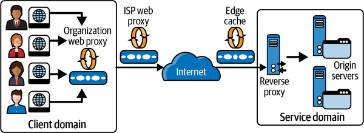

# Introduction

One of the reasons that websites are so highly responsive is that the internet is littered with web caches. Web caches store a copy of a given resource—for example, a web page or an image, for a defined time period. The caches intercept client requests and if they have a requested resource cached locally, they return the copy rather than forwarding the request to the target service. Hence, many requests can be satisfied without placing a burden on the service. Also, as the caches are physically closer to the client, the requests will have lower latencies.


Multiple levels of caches exist, starting with the client’s web browser cache and local organization-based caches. ISPs will also implement general web proxy caches, and reverse proxy caches can be deployed within the application services execution domain. Web browser caches are also known as private caches (for a single user). Organizational and ISP proxy caches are shared caches that support requests from multiple users. Edge caches, also known as content delivery networks (CDNs), live at various strategic geographical locations globally, so that they cache frequently accessed data close to clients.

Caches typically store the results of HTTP [`GET`](https://developer.mozilla.org/en-US/docs/Web/HTTP/Methods/GET) requests only, and the cache key is the URI of the associated `GET`. When a client sends a `GET` request, it may be intercepted by one or more caches along the request path. Any cache with a fresh copy of the requested resource may respond to the request. If no cached content is found, the request is served by the service endpoint, which is also called the origin server in web technology parlance. Services can control what results are cached and for how long they are stored by using HTTP caching directives. Services set these directives in various HTTP response headers

# Cache-Control

The [`Cache-Control`](https://developer.mozilla.org/en-US/docs/Web/HTTP/Headers/Cache-Control) HTTP header can be used by client requests and service responses to specify how the caching should be utilized for the resources of interest. Possible values are:

- `no-store`: Specifies that a resource from a request response should not be cached. This is typically used for sensitive data that needs to be retrieved from the origin servers each request.
- `no-cache`: Specifies that a cached resource must be revalidated with an origin server before use.
- `private`: Specifies a resource can be cached only by a user-specific device such as a web browser.
- `public`: Specifies a resource can be cached by any proxy server.
- `max-age`: Defines the length of time in seconds a cached copy of a resource should be retained. After expiration, a cache must refresh the resource by sending a request to the origin server.

<Callout type="warning">
  HTTP is designed to cache as much as possible, so even if no `Cache-Control`
  is given, responses will get stored and reused if certain conditions are met.
  This is called **heuristic caching**. Heuristic caching is a workaround that
  came before `Cache-Control` support became widely adopted, and basically all
  responses should explicitly specify a `Cache-Control` header.
</Callout>

# Expires and Last-Modified

The [`Expires`](https://developer.mozilla.org/en-US/docs/Web/HTTP/Headers/Expires) and [`Last-Modified`](https://developer.mozilla.org/en-US/docs/Web/HTTP/Headers/Last-Modified) HTTP headers interact with the `max-age` directive to control how long cached data is retained. Caches have limited storage resources and hence must periodically evict items from memory to create space. To influence cache eviction, services can specify how long resources in the cache should remain valid, or fresh. When a request arrives for a fresh resource, the cache serves the locally stored results without contacting the origin server. Once any specified retention period for a cached resource expires, it becomes stale and becomes a candidate for eviction.

Freshness is calculated using a combination of header values. The `Cache-Control: max-age=N` header is the primary directive, and this value specifies the freshness period in seconds. If `max-age` is not specified, the `Expires` header is checked next. If this header exists, then it is used to calculate the freshness period. The `Expires` header specifies an explicit date and time after which the resource should be considered stale. For example:

```
Expires: Wed, 21 Oct 2015 07:28:00 GMT
```

As a last resort, the `Last-Modified` header can be used to calculate resource retention periods. This header is set by the origin server to specify when a resource was last updated, and uses the same format as the `Expires` header. A cache server can use `Last-Modified` to determine the freshness lifetime of a resource based on a heuristic calculation that the cache supports. The calculation uses the `Date` header, which specifies the time a response message was sent from an origin server. How long to reuse is up to the implementation, but the specification recommends about 10% of the time after storing, which means a resource retention period subsequently becomes equal to the value of the `Date` header minus the value of the `Last-Modified` header divided by 10.

# Etag

HTTP provides another directive that can be used to control cache item freshness. This is known as an [`Etag`](https://developer.mozilla.org/en-US/docs/Web/HTTP/Headers/Etag). An `Etag` is an opaque value that can be used by a web cache to check if a cached resource is still valid. When a request arrives for a stale resource, the cache forwards it to the origin server with a [`If-None-Match`](https://developer.mozilla.org/en-US/docs/Web/HTTP/Headers/If-None-Match) directive along with the `Etag` to inquire if the resource is still valid. This is known as _revalidation_.

There are two possible responses to this request:

- If the `Etag` in the request matches the value associated with the resource in the service, the cached value is still valid. The origin server can therefore return a `304 (Not Modified)` response. No response body is needed as the cached value is still current, thus saving bandwidth, especially for large resources. The response may also include new cache directives to update the freshness of the cached resource.
- The origin server may ignore the revalidation request and respond with a `200 OK` response code, a response body and `Etag` representing the latest version of the resource.

# Summary

When used effectively, web caching can significantly reduce latencies and save network bandwidth. This is especially true for large items such as images and documents. Further, as web caches handle requests rather than application services, this reduces the request load on origin servers, creating additional capacity.
